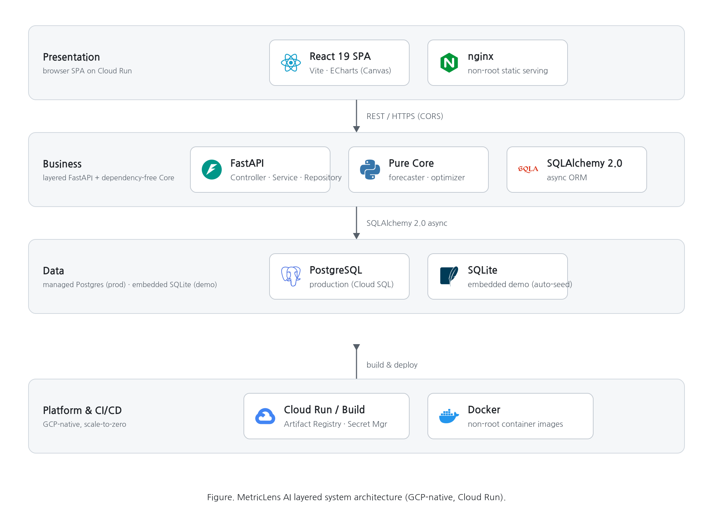
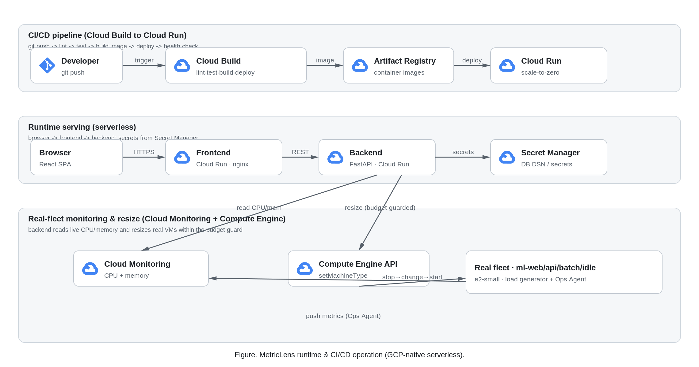
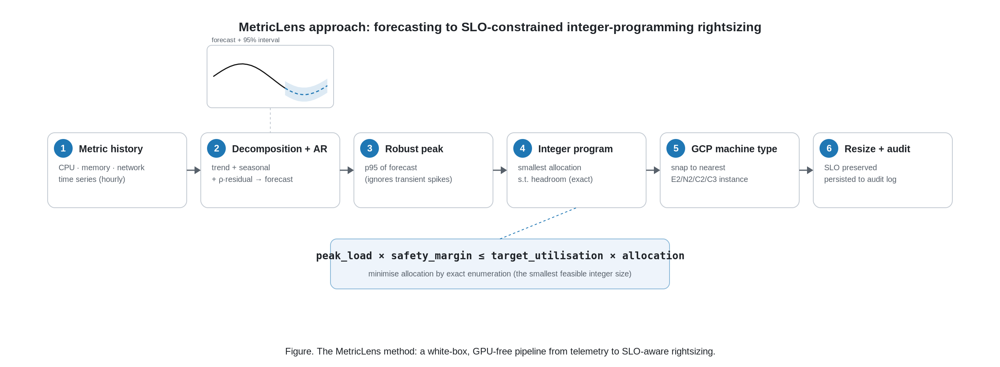

# MetricLens AI

경량 시계열 모델 기반 서버 리소스 부하 예측 및 동적 리사이징 최적화 시스템.
GPU 없이 범용 CPU만으로 부하를 예측하고, 정수 계획법으로 SLO를 보장하는 최소
자원 구성을 산출하여 OPEX·전력 낭비를 줄인다. **GCP Cloud Run + Cloud Build**에
배포된다.

## Live Endpoints

- 🖥️ **대시보드(프론트엔드)**: https://metriclens-frontend-f2ei3uwvfq-uc.a.run.app
- 🔌 **API(백엔드)**: https://metriclens-backend-f2ei3uwvfq-uc.a.run.app — Swagger `/docs`

## 차별점 (Why MetricLens)

기존 시장은 ⓐ K8s/클라우드 **SaaS 옵티마이저**(CAST AI·Sedai·StormForge — 텔레메트리
외부 전송·쿠버네티스 종속), ⓑ **CSP 내장 추천기**(AWS Compute Optimizer·Azure Advisor —
단일 클라우드·14일 윈도우·계절성 취약), ⓒ **온프레 모니터링**(SolarWinds·ManageEngine —
임계치/선형회귀 *리포팅* 수준, SLO 최적화 부재)로 나뉜다. MetricLens는 그 사이의 공백을 노린다:

- 🔒 **에어갭/온프레 자립형** — 외부 API·SaaS 콜백 0, 단일 컨테이너+내장 DB. 망분리(국방·금융·공공) 즉시 투입.
- 🪶 **GPU-프리 경량** — 표준 라이브러리 STL 예측기, 엣지 CPU 구동.
- 🎯 **처방적 정수계획 최적화** — "저활용 알림"이 아니라 SLO 제약 하 **최소 자원 정확해**.
- 🔍 **화이트박스 설명가능성** — MAPE·신뢰구간·헤드룸 수식으로 근거 투명(규제 감사 적합).
- 🧾 **감사 추적** — 모든 예측·리사이즈를 영속 기록.

상세 경쟁 분석: [docs/08_competitive_analysis.md](docs/08_competitive_analysis.md)

## 아키텍처



**구동 방식 (런타임·CI/CD):**



GCP 네이티브 서버리스: Cloud Build 파이프라인 → Cloud Run(scale-to-zero) 배포,
백엔드가 Cloud Monitoring으로 실제 인스턴스 CPU/메모리를 읽고 Compute Engine API로
예산 한도 내 실제 리사이즈.

**접근법 (방법 개요):**



텔레메트리 → 분해+AR 예측(95% 구간) → p95 피크 → SLO 제약 정수계획 → GCP 머신 타입 →
리사이즈. 모델 유효성은 [논문 수준 평가](docs/11_model_evaluation.md) 참조.

## 구성

| 영역 | 위치 | 스택 |
|---|---|---|
| 프론트엔드 | [frontend/](frontend/) | React 19 + Vite + ECharts, nginx(non-root) |
| 백엔드 | [backend/](backend/) | FastAPI 레이어드 + 순수 Core(예측·정수계획), SQLAlchemy async |
| DB 스키마/시드 | [scripts/](scripts/) | `schema.sql`, 근거 기반 워크로드 생성기 `app/core/workload.py`(결정론·멱등) |
| CI/CD | [cloudbuild.yaml](cloudbuild.yaml), [scripts/deploy.sh](scripts/deploy.sh) | Cloud Build 9-스테이지 → Cloud Run |
| 기술 문서 | [docs/](docs/) | 기능명세·아키텍처·API·ERD·시퀀스·인프라·테스트·경쟁분석·워크로드모델링·개발보고서 |

## 빠른 시작 (로컬)

```bash
# 백엔드 품질 게이트 (lint + 45 tests)
cd backend && python -m venv .venv && source .venv/bin/activate \
  && pip install -r requirements-dev.txt && cd .. && SKIP_FRONTEND=1 ./scripts/run_tests.sh

# 프론트엔드 (데모 데이터 폴백 내장)
cd frontend && npm install && npm run dev
```

## 배포

```bash
PROJECT_ID=knudc-yoonwoodev ./scripts/deploy.sh bootstrap
PROJECT_ID=knudc-yoonwoodev DATABASE_URL=postgresql://... ./scripts/deploy.sh migrate
PROJECT_ID=knudc-yoonwoodev \
  CLOUDSQL_INSTANCE=knudc-yoonwoodev:us-central1:metriclens-db ./scripts/deploy.sh deploy
```

자세한 설계·테스트·스크린샷은 [개발 완료 보고서](docs/development_report.md) 참조.

---

**Team 구글링 — googai_congress**
