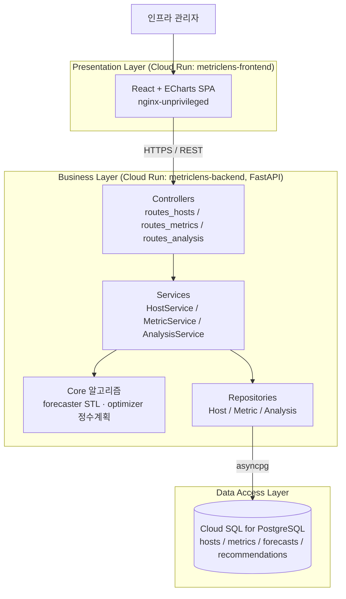
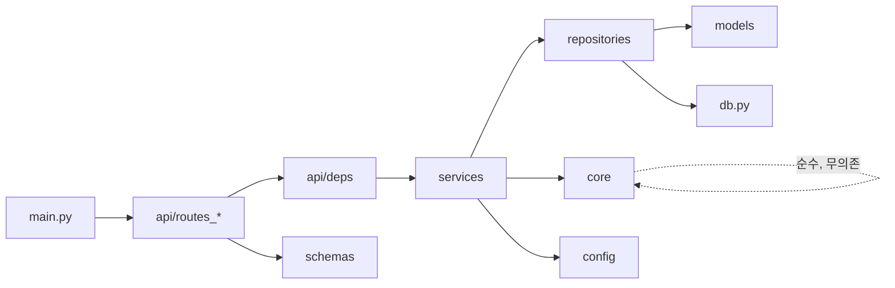

# 시스템 아키텍처 정의서 — MetricLens AI

## 1. 전체 레이어 아키텍처

본 시스템은 Presentation / Business / Data Access 3계층으로 분리된 레이어드
아키텍처를 채택한다. 백엔드는 단일 FastAPI 애플리케이션 내부에서 다시
Controller → Service → Repository 의 수직 분리를 강제하여, 시계열 예측·정수
계획 코어 로직(`core`)을 영속성·전송 관심사로부터 격리한다. 전 구성요소는
GCP 관리형 서버리스(Cloud Run) 위에서 컨테이너로 구동된다.

### 1.1. Presentation Layer
- **역할**: 시계열 메트릭, 예측, 리사이징 권장안의 시각화. 대용량 시계열을
  브라우저 메모리 부담 없이 렌더링하기 위해 Canvas 기반 ECharts를 사용한다.
- **기술 스택**: React 19 + Vite 빌드 산출물, nginx(non-root)로 정적 서빙.
- **배포 단위**: Cloud Run 서비스 `metriclens-frontend` (포트 8080).

### 1.2. Business Layer (FastAPI 레이어드)
- **Controller (`app/api`)**: HTTP 경계. 요청/응답 스키마 검증, 상태 코드와
  에러 카탈로그 매핑만 담당한다.
- **Service (`app/services`)**: 도메인 규칙(식별자 생성, 메트릭 선택, 예측 지평
  변환, 피크 산출)을 보유한다. Repository와 Core만 호출한다.
- **Core (`app/core`)**: 순수 함수. `forecaster`는 STL식 계절-추세 분해 후
  Holt-Winters 가산 외삽으로 예측하고 백테스트 MAPE를 산출한다. `optimizer`는
  헤드룸 제약 하의 정수 계획을 전수 탐색으로 정확히 푼다. 외부 의존성 0.
- **Repository (`app/repositories`)**: SQLAlchemy 비동기 세션으로 SQL을 발행하는
  유일한 계층.

### 1.3. Data Access Layer
- **역할**: 호스트 인벤토리, 메트릭 시계열 사실, 예측·권장 산출물 영속화.
- **기술 스택**: Cloud SQL for PostgreSQL 15. 스키마는 `scripts/schema.sql`
  (멱등 DDL)이 정본이며 `docs/04`와 일치한다.
- **시계열 최적화**: `metrics(host_id, ts)` 복합 인덱스 + `UNIQUE` 제약으로
  호스트별 시간 범위 질의와 멱등 적재를 동시에 보장한다.

## 2. 모듈 간 의존성 관계 맵

의존성은 단방향(상위 → 하위)으로만 흐른다. Core는 어떤 계층에도 의존하지
않으므로 단위 테스트가 DB 없이 가능하다.

## 3. 데이터 흐름 (예측 요청 기준)

1. 관리자가 대시보드에서 호스트를 선택 → 프론트엔드가 `POST /api/v1/hosts/{id}/forecast` 호출.
2. Controller가 쿼리 파라미터(`metric`, `horizon_minutes`)를 검증.
3. `AnalysisService`가 `MetricRepository`로 해당 호스트의 시계열을 조회.
4. 선택 메트릭 컬럼을 추출해 `core.forecaster.forecast()`에 전달 → 점 추정·신뢰구간·MAPE 산출.
5. 결과를 `forecasts` 테이블에 영속화하고 `ForecastOut` 스키마로 직렬화하여 응답.
6. 프론트엔드가 ECharts로 이력 + 예측 밴드를 렌더링.

리사이징 권장 흐름은 4단계에서 `optimizer.peak()`로 p95 피크를 구한 뒤
`optimizer.recommend_resize()`로 SLO 제약 하 최소 자원을 산출하는 점만 다르다.
