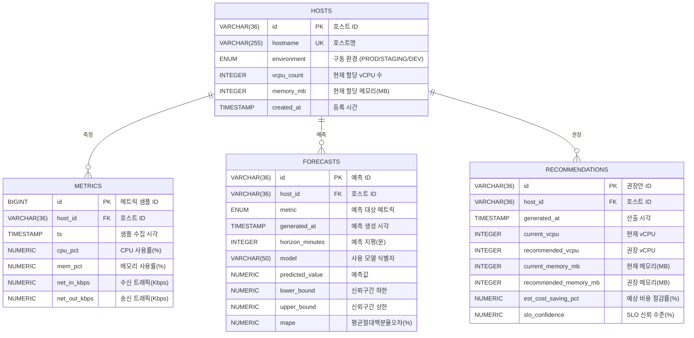

# ERD 및 데이터 사전 — MetricLens AI (시계열 부하 예측 도메인)

본 문서는 MetricLens AI의 영속성 계층을 정의한다. 도메인은 가상 서버(Host)의
다차원 성능 메트릭(CPU, Memory, Network I/O)을 이산 시간으로 적재하고, 이를
경량 시계열 모델로 예측한 뒤, 정수 계획법 기반의 리사이징 권장량을 산출하는
구조다. 대상 RDBMS는 **PostgreSQL 15**이며, 메트릭 사실 테이블(`metrics`)은
`(host_id, ts)` 복합 인덱스를 통해 시계열 범위 질의를 최적화한다.

## 1. ERD (Mermaid.js)

## 2. 데이터 사전

### HOSTS 테이블 — 모니터링 대상 가상 서버 인벤토리

| 물리명 | 논리명 | 데이터 타입 | 길이 | PK | FK | Nullable | Default | 제약조건 | 설명 |
|---|---|---|---|---|---|---|---|---|---|
| `id` | 호스트 ID | `VARCHAR` | 36 | Y | N | N | | `UNIQUE` | 호스트 고유 식별자(UUID) |
| `hostname` | 호스트명 | `VARCHAR` | 255 | N | N | N | | `UNIQUE` | 논리 호스트명 (예: `web-prod-01`) |
| `environment` | 구동 환경 | `ENUM` | | N | N | N | `'PROD'` | `('PROD','STAGING','DEV')` | 배포 환경 분류 |
| `vcpu_count` | 현재 vCPU | `INTEGER` | | N | N | N | | `CHECK (vcpu_count BETWEEN 1 AND 256)` | 현재 할당된 가상 코어 수 |
| `memory_mb` | 현재 메모리 | `INTEGER` | | N | N | N | | `CHECK (memory_mb BETWEEN 256 AND 4194304)` | 현재 할당된 메모리(MB) |
| `created_at` | 등록 시간 | `TIMESTAMP` | | N | N | N | `NOW()` | | 인벤토리 등록 시각(UTC) |

### METRICS 테이블 — 다차원 성능 메트릭 시계열 사실(Fact)

| 물리명 | 논리명 | 데이터 타입 | 길이 | PK | FK | Nullable | Default | 제약조건 | 설명 |
|---|---|---|---|---|---|---|---|---|---|
| `id` | 샘플 ID | `BIGINT` | | Y | N | N | `IDENTITY` | `UNIQUE` | 자동 증가 시퀀스 PK |
| `host_id` | 호스트 ID | `VARCHAR` | 36 | N | Y | N | | `REFERENCES HOSTS(id) ON DELETE CASCADE` | 측정 대상 호스트 |
| `ts` | 수집 시각 | `TIMESTAMP` | | N | N | N | | `INDEX (host_id, ts)` | 샘플 타임스탬프(UTC) |
| `cpu_pct` | CPU 사용률 | `NUMERIC` | (5,2) | N | N | N | | `CHECK (cpu_pct BETWEEN 0 AND 100)` | CPU 점유율 백분율 |
| `mem_pct` | 메모리 사용률 | `NUMERIC` | (5,2) | N | N | N | | `CHECK (mem_pct BETWEEN 0 AND 100)` | 메모리 점유율 백분율 |
| `net_in_kbps` | 수신 트래픽 | `NUMERIC` | (12,2) | N | N | N | | `CHECK (net_in_kbps >= 0)` | 인입 네트워크 처리량(Kbps) |
| `net_out_kbps` | 송신 트래픽 | `NUMERIC` | (12,2) | N | N | N | | `CHECK (net_out_kbps >= 0)` | 송출 네트워크 처리량(Kbps) |

### FORECASTS 테이블 — 경량 시계열 모델의 부하 예측 결과

| 물리명 | 논리명 | 데이터 타입 | 길이 | PK | FK | Nullable | Default | 제약조건 | 설명 |
|---|---|---|---|---|---|---|---|---|---|
| `id` | 예측 ID | `VARCHAR` | 36 | Y | N | N | | `UNIQUE` | 예측 레코드 식별자(UUID) |
| `host_id` | 호스트 ID | `VARCHAR` | 36 | N | Y | N | | `REFERENCES HOSTS(id) ON DELETE CASCADE` | 예측 대상 호스트 |
| `metric` | 예측 메트릭 | `ENUM` | | N | N | N | | `('CPU','MEM','NET_IN','NET_OUT')` | 예측 대상 메트릭 종류 |
| `generated_at` | 생성 시각 | `TIMESTAMP` | | N | N | N | `NOW()` | | 예측 산출 시각(UTC) |
| `horizon_minutes` | 예측 지평 | `INTEGER` | | N | N | N | | `CHECK (horizon_minutes BETWEEN 1 AND 10080)` | 미래 예측 구간(분) |
| `model` | 모델 식별자 | `VARCHAR` | 50 | N | N | N | `'STL_HOLTWINTERS'` | | 사용 알고리즘 식별자 |
| `predicted_value` | 예측값 | `NUMERIC` | (12,2) | N | N | N | | | 지평 시점의 점 추정치 |
| `lower_bound` | 신뢰 하한 | `NUMERIC` | (12,2) | N | N | N | | | 예측 신뢰구간 하한 |
| `upper_bound` | 신뢰 상한 | `NUMERIC` | (12,2) | N | N | N | | | 예측 신뢰구간 상한 |
| `mape` | 예측 오차 | `NUMERIC` | (5,2) | N | N | Y | | `CHECK (mape >= 0)` | 백테스트 MAPE(%) — 목표 15% 이내 |

### RECOMMENDATIONS 테이블 — 정수 계획법 기반 리사이징 권장안

| 물리명 | 논리명 | 데이터 타입 | 길이 | PK | FK | Nullable | Default | 제약조건 | 설명 |
|---|---|---|---|---|---|---|---|---|---|
| `id` | 권장안 ID | `VARCHAR` | 36 | Y | N | N | | `UNIQUE` | 권장 레코드 식별자(UUID) |
| `host_id` | 호스트 ID | `VARCHAR` | 36 | N | Y | N | | `REFERENCES HOSTS(id) ON DELETE CASCADE` | 권장 대상 호스트 |
| `generated_at` | 산출 시각 | `TIMESTAMP` | | N | N | N | `NOW()` | | 권장안 산출 시각(UTC) |
| `current_vcpu` | 현재 vCPU | `INTEGER` | | N | N | N | | `CHECK (current_vcpu >= 1)` | 산출 시점의 vCPU |
| `recommended_vcpu` | 권장 vCPU | `INTEGER` | | N | N | N | | `CHECK (recommended_vcpu >= 1)` | 정수 계획법 산출 vCPU |
| `current_memory_mb` | 현재 메모리 | `INTEGER` | | N | N | N | | `CHECK (current_memory_mb >= 256)` | 산출 시점의 메모리(MB) |
| `recommended_memory_mb` | 권장 메모리 | `INTEGER` | | N | N | N | | `CHECK (recommended_memory_mb >= 256)` | 권장 메모리(MB) |
| `est_cost_saving_pct` | 예상 절감률 | `NUMERIC` | (5,2) | N | N | N | `0` | `CHECK (est_cost_saving_pct BETWEEN -100 AND 100)` | 현재 대비 비용 절감률(%) |
| `slo_confidence` | SLO 신뢰수준 | `NUMERIC` | (5,2) | N | N | N | | `CHECK (slo_confidence BETWEEN 0 AND 100)` | 권장 적용 시 보장 가용성(%) |

## 3. 무결성 및 인덱싱 정책

- **참조 무결성**: 모든 자식 테이블(`metrics`, `forecasts`, `recommendations`)은
  `host_id`에 대해 `ON DELETE CASCADE`를 가진다. 호스트 폐기 시 종속 시계열과
  파생 산출물이 원자적으로 함께 제거된다.
- **시계열 인덱스**: `metrics(host_id, ts)` 복합 B-Tree 인덱스로 호스트별 시간
  범위 스캔을 로그 시간 내에 처리한다. 정렬은 `ts ASC` 기준이다.
- **도메인 제약**: `cpu_pct`/`mem_pct`는 `[0,100]`로 물리적 점유율 범위를 강제하고,
  네트워크 처리량은 음수를 금지한다. 이는 경계값 분석 테스트의 기준이 된다.
- **시드 멱등성**: 모든 시드 레코드는 결정론적 UUID와 `ON CONFLICT (id) DO NOTHING`을
  사용하여 반복 적재 시 동일 상태를 보장한다. 상세는 `scripts/generate_test_data.sh`.
