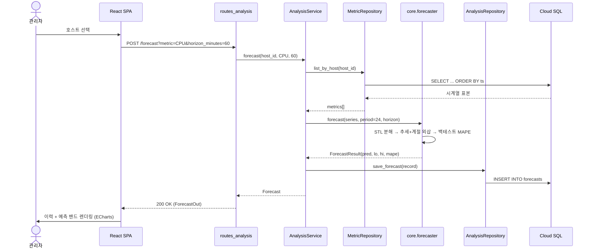
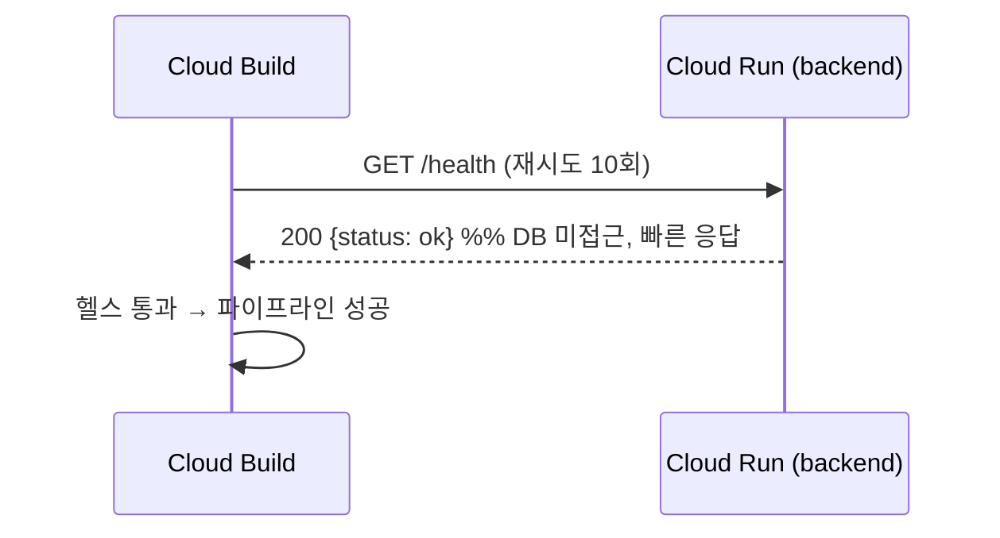

# 시퀀스 다이어그램 — MetricLens AI

클라이언트(SPA), 프론트엔드 인그레스(nginx), 백엔드 FastAPI 계층(Controller →
Service → Repository), 순수 Core 알고리즘, Cloud SQL(PostgreSQL) 간의 생명주기와
트랜잭션 경계를 매핑한다.

## 1. 메트릭 적재 (배치 ingest)

```mermaid
sequenceDiagram
    actor Agent as 메트릭 수집기
    participant FE as nginx (frontend)
    participant CTRL as routes_metrics
    participant SVC as MetricService
    participant REPO as MetricRepository
    participant DB as Cloud SQL (metrics)

    Agent->>CTRL: POST /api/v1/hosts/{id}/metrics (MetricIn[])
    CTRL->>CTRL: Pydantic 검증 (0–100, ≥0)
    CTRL->>SVC: ingest(host_id, samples)
    SVC->>REPO: get(host_id)
    REPO->>DB: SELECT host
    alt 호스트 없음
        DB-->>REPO: null
        REPO-->>SVC: None
        SVC-->>CTRL: HostNotFoundError
        CTRL-->>Agent: 404 Not Found
    else 호스트 존재
        SVC->>REPO: bulk_insert(rows)
        REPO->>DB: BEGIN; INSERT ... ON CONFLICT (host_id,ts); COMMIT
        DB-->>REPO: rowcount
        REPO-->>SVC: n
        SVC-->>CTRL: n
        CTRL-->>Agent: 202 Accepted {ingested: n}
    end
```

## 2. 부하 예측 (forecast)



## 3. 리사이징 권장 (recommendation)

```mermaid
sequenceDiagram
    actor User as 관리자
    participant FE as React SPA
    participant CTRL as routes_analysis
    participant SVC as AnalysisService
    participant REPO as MetricRepository
    participant OPT as core.optimizer
    participant DB as Cloud SQL

    User->>FE: 권장안 요청
    FE->>CTRL: POST /recommendation
    CTRL->>SVC: recommend(host_id)
    SVC->>REPO: list_by_host(host_id)
    REPO->>DB: SELECT metrics
    DB-->>REPO: 시계열
    SVC->>OPT: peak(cpu[],95), peak(mem[],95)
    SVC->>OPT: recommend_resize(vcpu, mem, peakCpu, peakMem, target, margin, slo)
    OPT->>OPT: 헤드룸 제약 하 정수 전수 탐색
    OPT-->>SVC: ResizeRecommendation
    SVC->>DB: INSERT INTO recommendations
    SVC-->>CTRL: Recommendation
    CTRL-->>FE: 200 OK (RecommendationOut)
    FE->>User: 현재→권장 카드, 절감률·SLO 표시
```

## 4. 헬스 체크 (배포 후)


