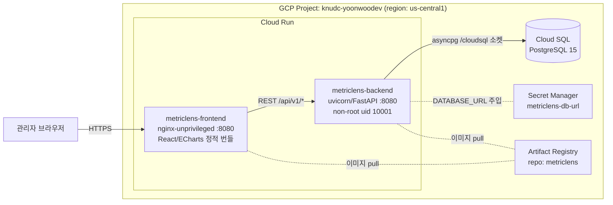
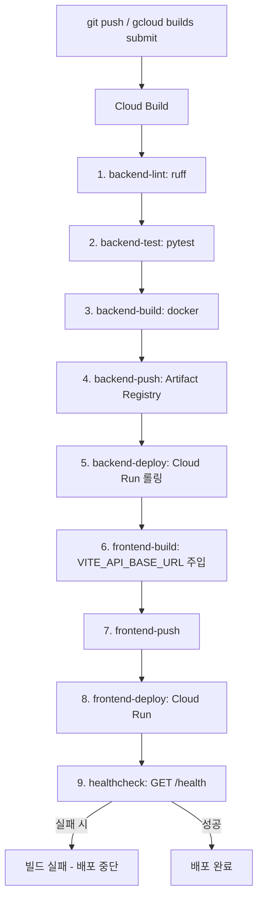

# 네트워크 및 인프라 구성도 — MetricLens AI (GCP Cloud Run)

본 시스템은 GCP 관리형 서버리스 컨테이너 플랫폼(Cloud Run) 위에 배포된다.
CI/CD는 Cloud Build가, 이미지 저장은 Artifact Registry가, 영속성은 Cloud SQL
for PostgreSQL이, 비밀 관리는 Secret Manager가 담당한다. 모든 컨테이너는
non-root 보안 컨텍스트로 구동되며 포트 8080을 노출한다.

## 1. 외부 트래픽 인입 및 서비스 토폴로지



- **프론트엔드**는 빌드 시점에 `VITE_API_BASE_URL`로 백엔드 Cloud Run URL을
  번들에 주입받아, 브라우저가 백엔드를 직접 호출한다(별도 게이트웨이 불필요).
- **백엔드**는 Cloud SQL Auth 연결(`--add-cloudsql-instances`)을 통해 유닉스
  소켓 `/cloudsql/PROJECT:REGION:INSTANCE` 로 PostgreSQL에 접속한다.
- **비밀**은 코드·이미지에 포함하지 않고 Secret Manager → 환경변수
  `METRICLENS_DATABASE_URL`로 런타임 주입한다.

## 2. CI/CD 파이프라인 흐름 (Cloud Build)



각 스테이지는 fail-fast다. 린트/테스트가 깨지면 이미지 빌드 이전에 중단되고,
헬스 체크가 실패하면 빌드가 실패로 표시된다. 이미지는 `$SHORT_SHA`(불변)와
`latest` 두 태그로 푸시되어 롤백 추적이 가능하다.

## 3. 자원 구성 (Cloud Run 서비스)

| 서비스 | 이미지 | CPU | 메모리 | min/max 인스턴스 | 포트 | 인증 |
|---|---|---|---|---|---|---|
| `metriclens-backend` | `.../metriclens-backend` | 1 | 512Mi | 0 / 10 | 8080 | 공개 |
| `metriclens-frontend` | `.../metriclens-frontend` | 1 | 256Mi | 0 / 5 | 8080 | 공개 |

- **스케일 투 제로**: 두 서비스 모두 `min-instances=0`으로 유휴 시 비용 0.
  ESG·OPEX 절감이라는 과제 목표를 인프라 차원에서도 구현한다.
- **무중단 배포**: Cloud Run의 리비전 기반 롤링 업데이트로, 새 리비전이 헬스
  체크를 통과한 뒤에야 트래픽이 100% 전환된다.

## 4. 부트스트랩 및 배포 절차

```bash
# 1) 프로젝트 부트스트랩 (API 활성화 + Artifact Registry, 멱등)
PROJECT_ID=knudc-yoonwoodev ./scripts/deploy.sh bootstrap

# 2) DB 스키마 + 시드 적재 (멱등; 기존 데이터 비파괴)
PROJECT_ID=knudc-yoonwoodev DATABASE_URL="postgresql://..." \
  ./scripts/deploy.sh migrate

# 3) 파이프라인 실행 (build → test → push → deploy → healthcheck)
PROJECT_ID=knudc-yoonwoodev \
  CLOUDSQL_INSTANCE=knudc-yoonwoodev:us-central1:metriclens-db \
  ./scripts/deploy.sh deploy
```
