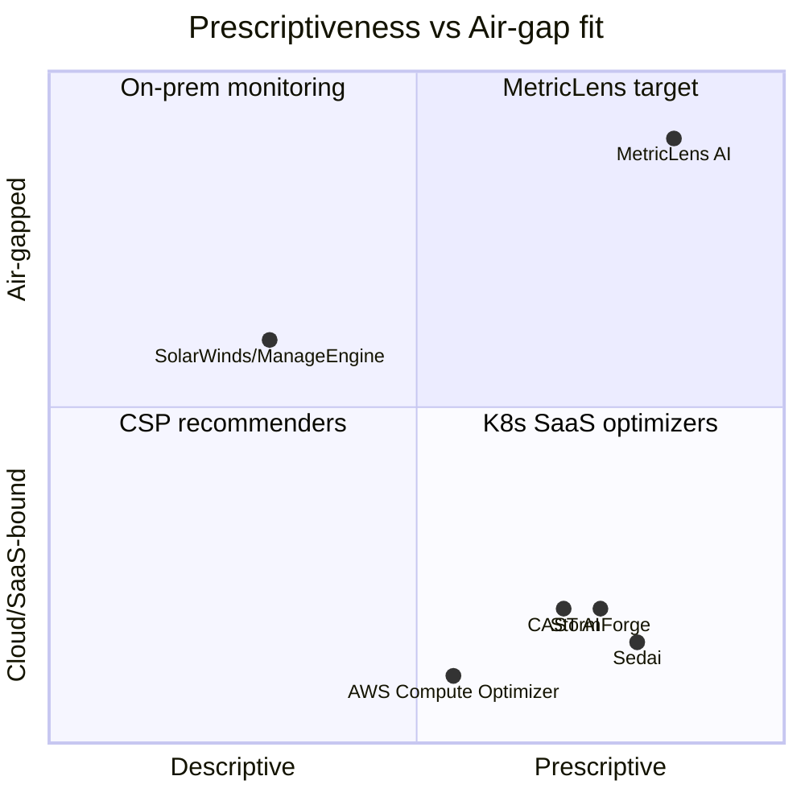

# 시장 경쟁 분석 및 차별화 전략 — MetricLens AI

본 문서는 서버 자원 예측·라이트사이징(rightsizing) 최적화 시장의 경쟁 지형을
분석하고, MetricLens AI의 차별화 포인트와 포지셔닝을 정의한다. (조사 시점:
2026-06, 출처는 문서 말미 참조.)

## 1. 시장 지형: 3개 카테고리

### 1.1. 쿠버네티스/클라우드 SaaS 옵티마이저
대표: **CAST AI, Sedai, StormForge, PerfectScale, Kubecost, ScaleOps, nOps**

- 컨테이너(Pod/Node) CPU·메모리 요청을 ML로 자동 튜닝하고, 대부분 자율(autonomous)
  실시간 리사이징을 지향한다. StormForge는 워크로드별 ML 모델을 28일+ 관측으로
  학습하고, Sedai는 스파이크 이전에 선제 오토스케일링을 수행한다.
- **한계(폐쇄망 관점)**: 대부분 SaaS로 텔레메트리를 외부(벤더 클라우드)로 전송해야
  하고, 사실상 쿠버네티스·퍼블릭 클라우드 환경을 전제한다. 모델은 블랙박스 ML이다.

### 1.2. 관리형 클라우드 추천기 (CSP 내장)
대표: **AWS Compute Optimizer, Azure Advisor, Google Active Assist/Recommender, IBM Turbonomic**

- 해당 클라우드 사용량을 분석해 인스턴스 사이즈를 추천한다.
- **한계**: 특정 클라우드에 종속되며, 지원 인스턴스 패밀리가 제한적이다(예: Compute
  Optimizer는 M/C/R/T/X 계열). 14일 수준의 짧은 윈도우에 기반해 계절성·버스트·
  네트워크/디스크 I/O가 큰 워크로드에서 정확도가 떨어진다. 온프레미스는 대상이 아니다.

### 1.3. 온프레미스 인프라 모니터링/용량계획
대표: **SolarWinds SAM, ManageEngine OpManager/Applications Manager, IDERA Uptime**

- 온프레미스에서 동작하며 CPU·메모리·디스크의 임계치 도달 시점을 예측(주로 선형회귀
  또는 단순 ML)하고, 과/저활용 서버를 식별해 리포팅한다.
- **한계**: '서술적(descriptive) 리포팅'에 가깝다. "이 서버는 저활용"까지는 알려주되,
  **SLO 제약 하에서 비용을 최소화하는 정량적 최적 사양을 풀어주지는 않는다**(정수
  계획 등 수리 최적화 부재). 권장의 근거가 임계치·추세선 수준이다.

## 2. 시장 공백 (Unmet Needs)

| 공백 | SaaS 옵티마이저 | CSP 추천기 | 온프레 모니터링 | MetricLens |
|---|---|---|---|---|
| 폐쇄망/에어갭 자립 구동(외부 전송 0) | ✕ | ✕ | △ | **○** |
| 멀티클라우드/온프레/VM·베어메탈 무관 | △(K8s) | ✕(단일 CSP) | ○ | **○** |
| GPU 불필요·경량(엣지 CPU 구동) | ✕(무거운 ML) | N/A | △ | **○** |
| SLO 제약 정수계획 기반 *처방적* 최적화 | △ | △ | ✕ | **○** |
| 화이트박스 설명가능성(MAPE·신뢰구간·헤드룸 수식) | ✕(블랙박스) | ✕ | △ | **○** |
| 감사 추적(예측·리사이즈 이력 영속) | △ | ✕ | △ | **○** |

(○ 충족 / △ 부분 / ✕ 미충족)

## 3. MetricLens AI 차별화 포인트

1. **에어갭/온프레미스 자립형 (Sovereign by design)**
   외부 API·SaaS 콜백·텔레메트리 유출이 전혀 없다. 단일 컨테이너 + 내장 DB로
   완결되어 망분리 환경(국방·금융·공공: CUI·GDPR·DORA 등)에 즉시 투입 가능하다.
   CAST AI/Sedai/StormForge/CSP 추천기가 구조적으로 진입할 수 없는 영역이다.

2. **GPU-프리 경량 추론 (CPU-only, 표준 라이브러리)**
   네이티브 의존성 0의 STL식 분해 예측기로, 저사양·엣지 CPU에서도 수천 대
   메트릭을 처리하도록 설계했다. 경쟁사의 워크로드별 대형 ML 모델 대비 운영
   비용과 콜드스타트 부담이 작다.

3. **SLO 제약 정수계획 기반 처방적 최적화 (Prescriptive, not descriptive)**
   "저활용"을 알려주는 데 그치지 않고, `peak_load × margin ≤ target_util ×
   allocation` 제약 하에서 비용을 최소화하는 **정확한 정수해**를 전수 탐색으로
   산출한다. p95 피크 통계로 단발 스파이크의 과프로비저닝을 차단한다. 온프레
   모니터링 도구의 임계치·추세선 권장과 본질적으로 다르다.

4. **화이트박스 설명가능성**
   예측은 추세+계절 분해와 백테스트 MAPE로, 사이징은 헤드룸 부등식으로 근거가
   완전히 투명하다. 블랙박스 ML SaaS와 달리 규제 감사·내부 검증에 적합하다.

5. **감사 추적 가능한 의사결정 (Auditable)**
   모든 예측·리사이즈가 `actions` 테이블에 영속 기록되어 "누가 언제 16→8 vCPU로
   얼마나 줄였는지"를 거버넌스 관점에서 추적한다.

6. **인프라 비종속 (K8s/CSP-agnostic)**
   Pod가 아니라 일반 호스트(vCPU/메모리)를 모델링하므로 VM·하이퍼바이저·베어메탈
   등 온프레에서 흔한 형태에 그대로 적용된다.

## 4. 포지셔닝

**한 줄 포지셔닝**: *"폐쇄망 온프레미스를 위한, GPU 없는 경량·설명가능 처방적
리사이징 엔진"* — 클라우드 SaaS 옵티마이저가 줄 수 없는 데이터 주권과, 온프레
모니터링 도구가 주지 못하는 SLO 제약 수리 최적화를 동시에 제공한다.

## 5. 출처

- Sedai, "Top Cloud Cost Management / Kubernetes Cost Tools (2026)" — https://sedai.io/blog/best-cloud-cost-management-platforms , https://sedai.io/blog/kubernetes-cost-management-top-tools
- CloudBolt, "Top Kubecost Alternatives (2026)" — https://www.cloudbolt.io/blog/top-kubecost-alternatives/
- ScaleOps, "Best Kubernetes Cost Optimization Solutions" — https://scaleops.com/blog/how-to-choose-the-right-kubernetes-cost-optimization-solution-for-your-infrastructure/
- AWS, "Compute Optimizer requirements / FAQs" — https://docs.aws.amazon.com/compute-optimizer/latest/ug/requirements.html , https://aws.amazon.com/compute-optimizer/faqs/
- J. Chapel, "AWS Compute Optimizer Review" — https://jaychapel.medium.com/aws-compute-optimizer-review-not-quite-rightsized-for-rightsizing-3b8faef24fe
- SolarWinds SAM, "Server Capacity" — https://www.solarwinds.com/server-application-monitor/use-cases/server-capacity
- ManageEngine, "Capacity Planning / Storage Forecasting" — https://www.manageengine.com/products/applications_manager/capacity-planning.html
- Tabnine / systemprompt.io, air-gapped deployment requirements (CUI/GDPR/DORA) — https://www.tabnine.com/blog/what-it-really-takes-to-be-air-gapped/ , https://systemprompt.io/guides/self-hosted-ai-governance
