# UML 모델링 — MetricLens AI

본 문서는 MetricLens AI 시스템을 UML 2.x 다이어그램으로 모델링한다. 실제
코드베이스(`backend/app/`, `frontend/src/`)와 일치하도록 작성했으며, 모든
다이어그램은 Mermaid로 렌더링된다.

목차: [유스케이스](#1-유스케이스-다이어그램) · [클래스](#2-클래스-다이어그램) ·
[객체](#3-객체-다이어그램) · [시퀀스](#4-시퀀스-다이어그램) ·
[커뮤니케이션](#5-커뮤니케이션-다이어그램) · [액티비티](#6-액티비티-다이어그램) ·
[상태 머신](#7-상태-머신-다이어그램) · [컴포넌트](#8-컴포넌트-다이어그램) ·
[패키지](#9-패키지-다이어그램) · [배치](#10-배치-다이어그램) ·
[복합 구조](#11-복합-구조-다이어그램) · [타이밍](#12-타이밍-다이어그램)

---

## 1. 유스케이스 다이어그램

운영자(SRE)가 MetricLens로 수행하는 기능과 외부 액터(GCP)를 표현한다.

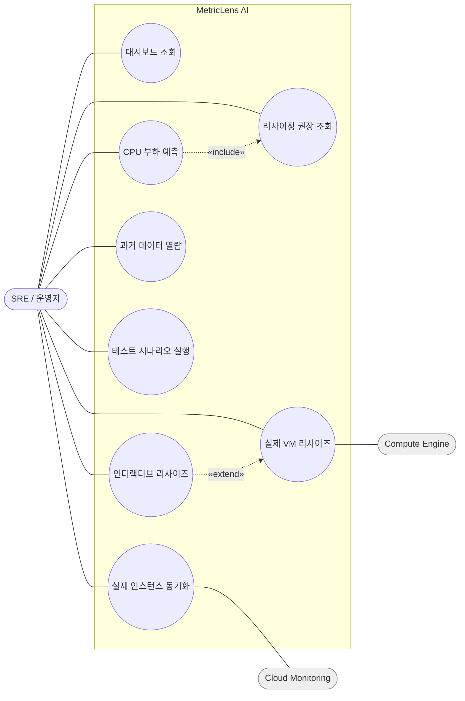

| 유스케이스 | 액터 | 설명 |
|---|---|---|
| 부하 예측 | SRE | 호스트의 +60분 CPU를 예측하고 MAPE를 표시 |
| 리사이징 권장 | SRE | SLO 제약 정수계획으로 최소 자원 산출(예측 결과 «include») |
| 인터랙티브 리사이즈 | SRE | 권장/머신타입 적용(실제 VM이면 «extend»로 GCE 호출) |
| 실제 인스턴스 동기화 | SRE, Cloud Monitoring | 라벨된 GCE 인스턴스의 실측 메트릭 ingest |

---

## 2. 클래스 다이어그램

레이어드 구조(Controller→Service→Repository + 순수 Core)와 도메인 모델.

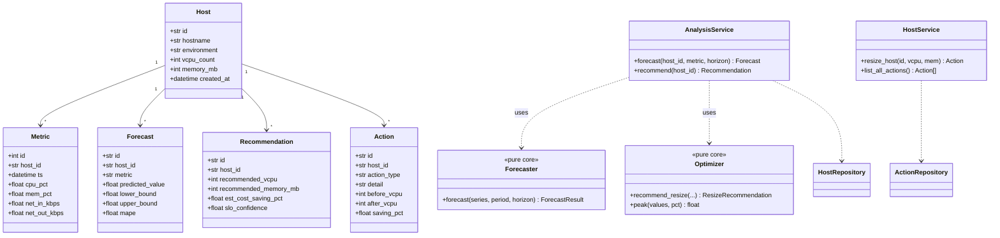

---

## 3. 객체 다이어그램

특정 시점(데모 플릿)의 인스턴스 스냅샷.

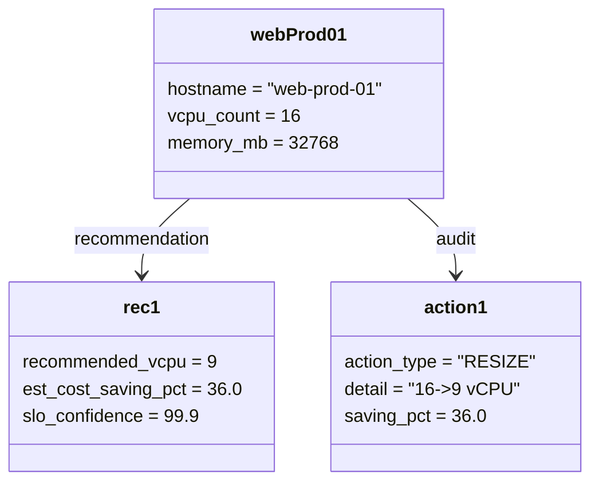

---

## 4. 시퀀스 다이어그램

### 4.1 예측 → 권장 → 리사이즈

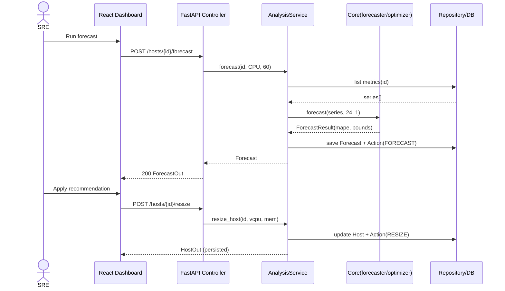

### 4.2 실제 인스턴스 동기화 (Cloud Monitoring)

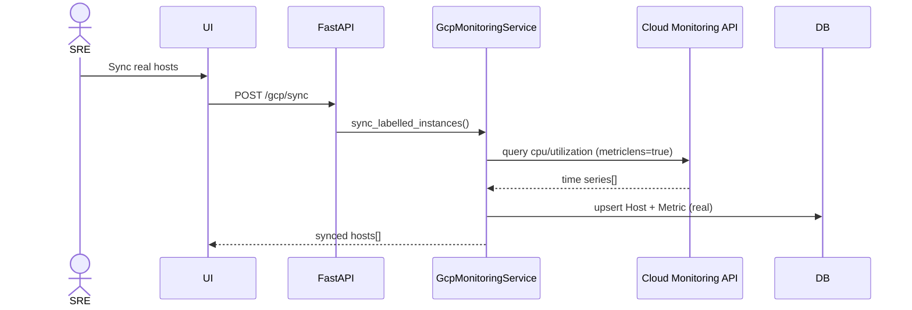

---

## 5. 커뮤니케이션 다이어그램

시퀀스 4.1과 의미적으로 동일하나 협업(메시지 번호) 관점.

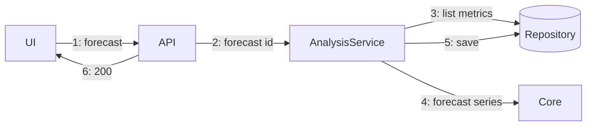

---

## 6. 액티비티 다이어그램

예측–권장–리사이즈 워크플로우(분기/병합 포함).

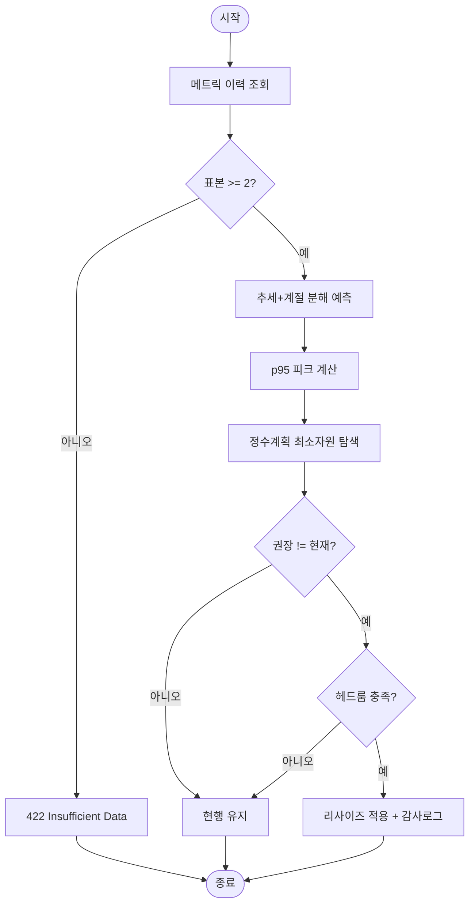

---

## 7. 상태 머신 다이어그램

호스트(특히 실제 VM)의 리사이즈 생명주기.

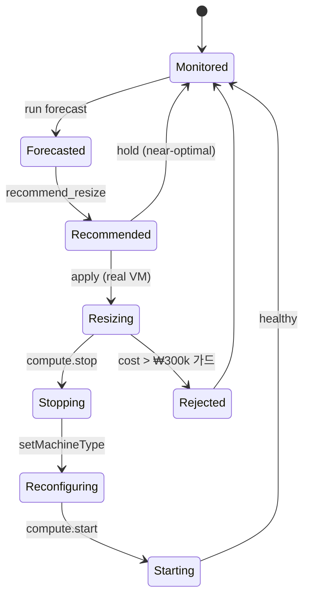

---

## 8. 컴포넌트 다이어그램

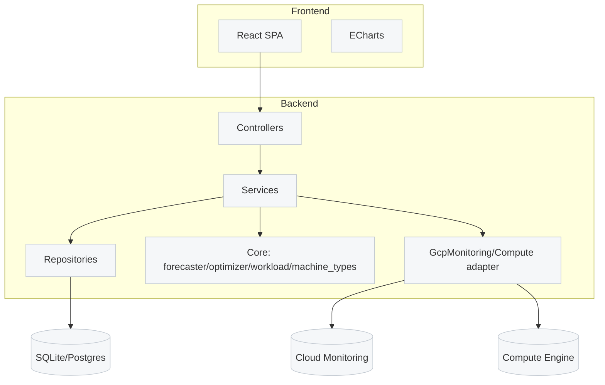

---

## 9. 패키지 다이어그램

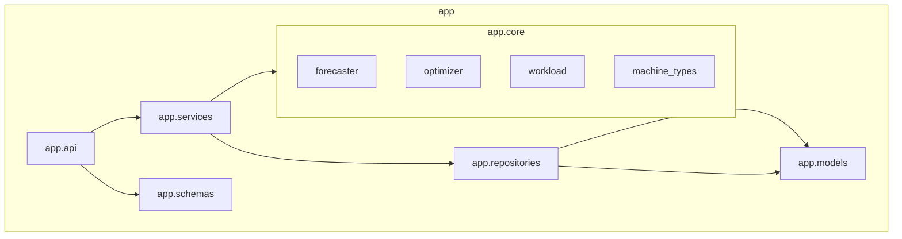

---

## 10. 배치 다이어그램

물리/클라우드 배치(GCP 네이티브).

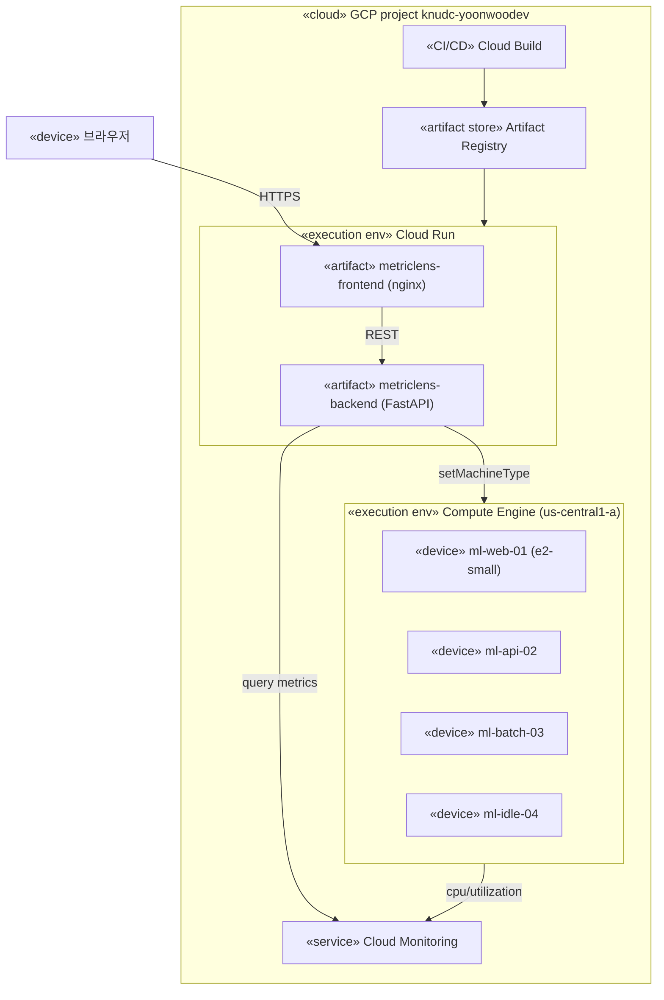

---

## 11. 복합 구조 다이어그램

`AnalysisService`의 내부 부품(part)과 포트.

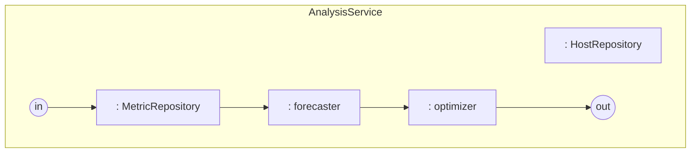

---

## 12. 타이밍 다이어그램

리사이즈 시 실제 VM 상태의 시간축 변화(Mermaid 미지원 → ASCII 표현).

```
상태
RUNNING     ────┐                              ┌────────────
STOPPING        └──┐                        
TERMINATED         └────┐              ┌──┘
RECONFIG                └──(setType)──┘
            t0   t1   t2          t3   t4  →  시간
            apply stop  terminated  setType start
```

> 실제 리사이즈는 stop → setMachineType → start 순으로 진행되며, 다운타임은
> t1~t4 구간이다. `≤ ₩300k/월` 비용 가드를 통과한 경우에만 수행된다.

---

마지막 갱신: 2026-06-03 · 생성 근거: 실제 코드베이스(`backend/app/`) 및 배포 구성.
