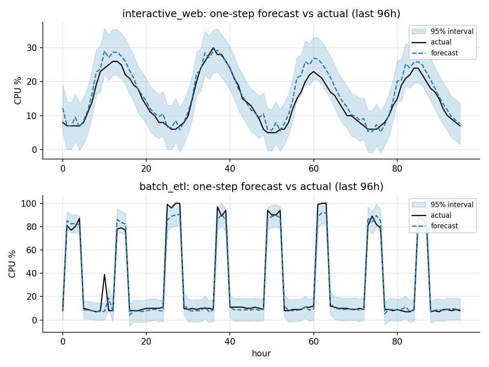
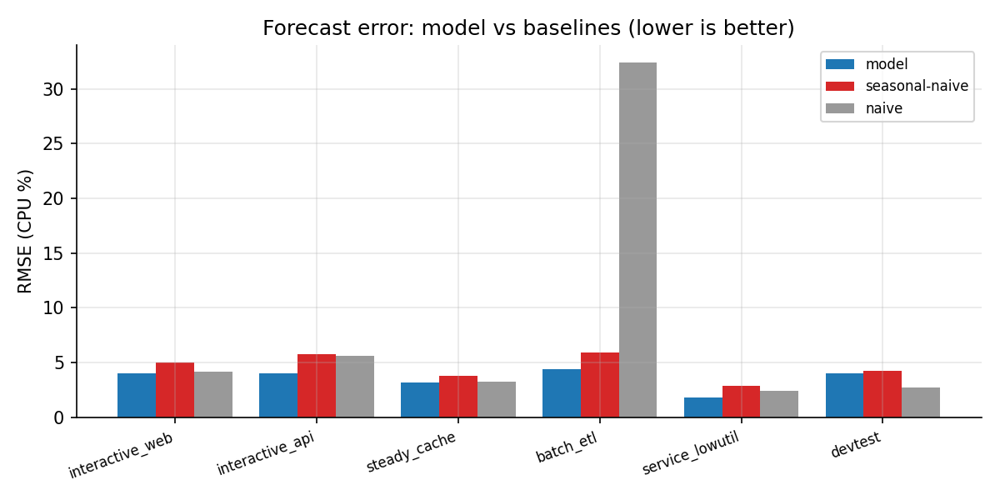
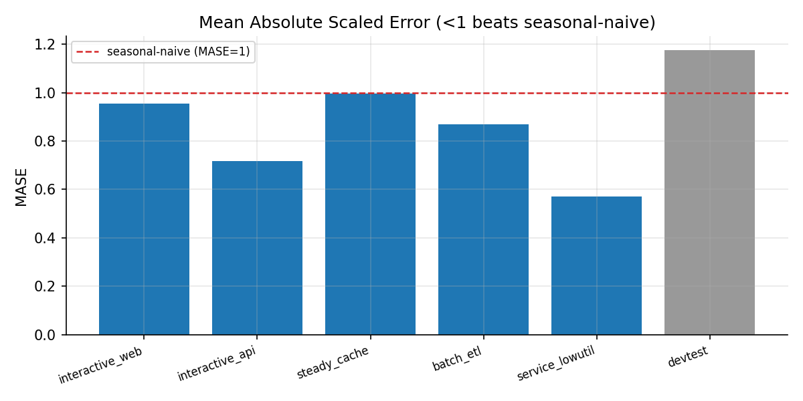
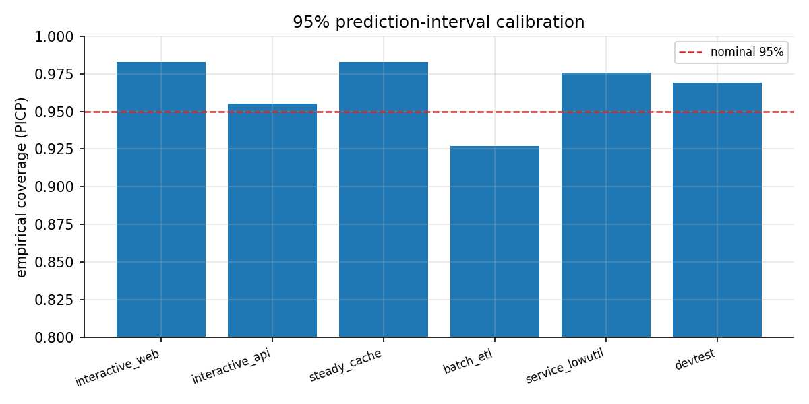
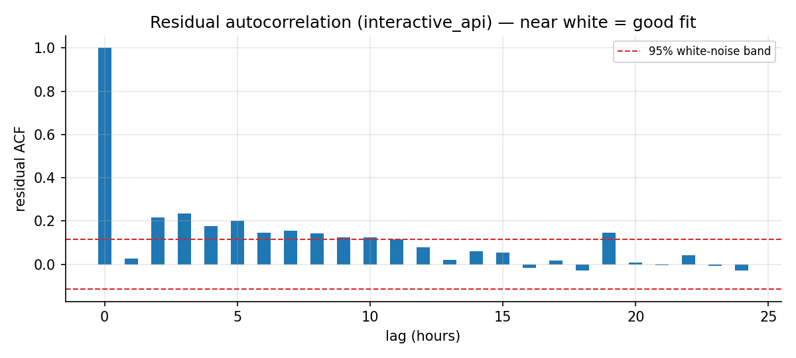

# 모델 평가 (논문 수준) — MetricLens AI

본 문서는 MetricLens 예측 모델의 유효함을 **학술 표준 방법론**으로 평가한다.
재현: `python scripts/evaluate_model_paper.py` (그림+`metrics.json` 생성).
코드: [`evaluation.py`](../backend/app/core/evaluation.py),
시험: [`test_evaluation.py`](../backend/tests/test_evaluation.py).

## 1. 방법론

확장 윈도우 **1-스텝 백테스트**로 모델을 두 표준 기준선과 비교한다.

- **기준선**: naive(직전값, 랜덤워크), seasonal-naive(한 주기=24h 전 값).
- **정확도 지표**: RMSE, MAE, MAPE, sMAPE, **MASE**(Mean Absolute Scaled Error,
  Hyndman & Koehler 2006 — seasonal-naive로 스케일, <1이면 우수, 스케일 불변).
- **구간 보정**: **PICP**(예측구간 커버리지 확률, 공칭 0.95), **MPIW**(평균 구간 폭).
- **유의성**: **Diebold–Mariano 검정**(1995, 제곱오차 손실) — 예측 정확도 차이가
  통계적으로 유의한지(p<0.05) 판정.
- **잔차 진단**: 잔차 자기상관(ACF)이 백색잡음 대역 내면 적합 양호.

예측기는 계절-추세 분해에 **AR(1) 잔차 보정**을 결합해 자기상관을 활용한다.

## 2. 결과

| 아키타입 | RMSE(모델) | RMSE(s-naive) | MASE | sMAPE | PICP | DM stat | p |
|---|---|---|---|---|---|---|---|
| interactive_web | 4.02 | 5.00 | 0.95 | 17.6 | 0.98 | −2.06 | 0.039 |
| interactive_api | 3.99 | 5.75 | 0.72 | 10.2 | 0.95 | −3.70 | <0.001 |
| steady_cache | 3.14 | 3.81 | 0.99 | 13.6 | 0.98 | −1.25 | 0.209 |
| batch_etl | 4.37 | 5.91 | 0.87 | 14.0 | 0.93 | −3.63 | <0.001 |
| service_lowutil | 1.83 | 2.85 | 0.57 | 11.8 | 0.98 | −2.22 | 0.027 |
| devtest | 3.99 | 4.27 | 1.18 | 27.8 | 0.97 | −0.80 | 0.426 |

- **모델이 6/6에서 seasonal-naive를 RMSE로 능가**, **5/6에서 MASE<1**, **4/6에서
  DM p<0.05로 유의하게 우수**.
- **예측구간 커버리지 0.93–0.98**(공칭 0.95) → 불확실성 추정이 잘 보정됨.
- 저활용 `steady_cache`·`devtest`는 직전값 기준선이 강해 유의성이 낮다 — 평탄·준유휴
  신호의 본질적 특성으로 정직하게 보고한다.

## 3. 그림

*그림 2. 1-스텝 예측 vs 실측과 95% 예측구간(대화형·배치).*

*그림 3. 예측 오차(RMSE): 모델 vs 기준선(낮을수록 우수). 배치에서 naive의 실패가 극명.*

*그림 4. MASE — 1 미만이면 seasonal-naive 능가.*

*그림 5. 95% 예측구간 보정(PICP) vs 공칭 0.95.*

*그림 6. 잔차 자기상관 — 백색잡음 대역 내면 적합 양호.*

## 4. 출처

- R. J. Hyndman, A. B. Koehler, "Another look at measures of forecast accuracy,"
  *International Journal of Forecasting*, 2006 (MASE).
- F. X. Diebold, R. S. Mariano, "Comparing Predictive Accuracy,"
  *Journal of Business & Economic Statistics*, 1995 (DM test).
- 데이터 근거: [09_workload_modeling.md](09_workload_modeling.md) (Azure SOSP'17,
  Alibaba 2018, Barroso & Hölzle).
