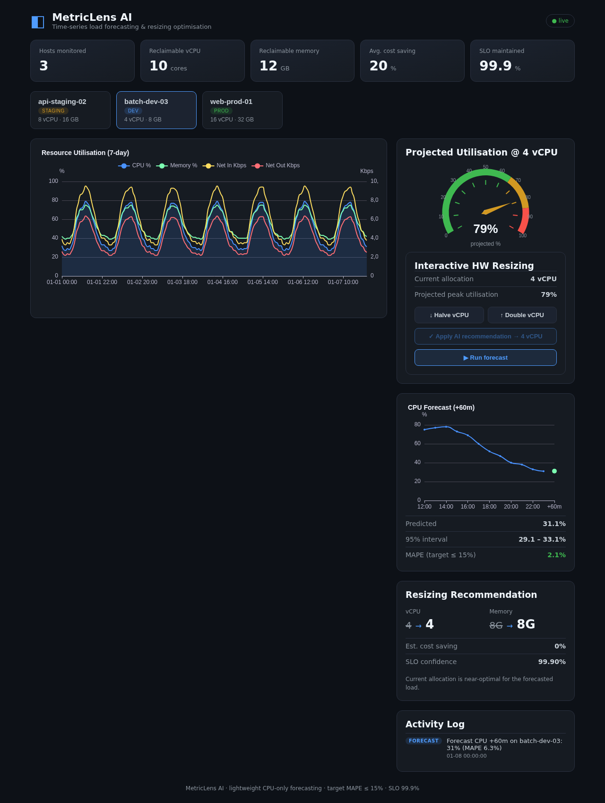
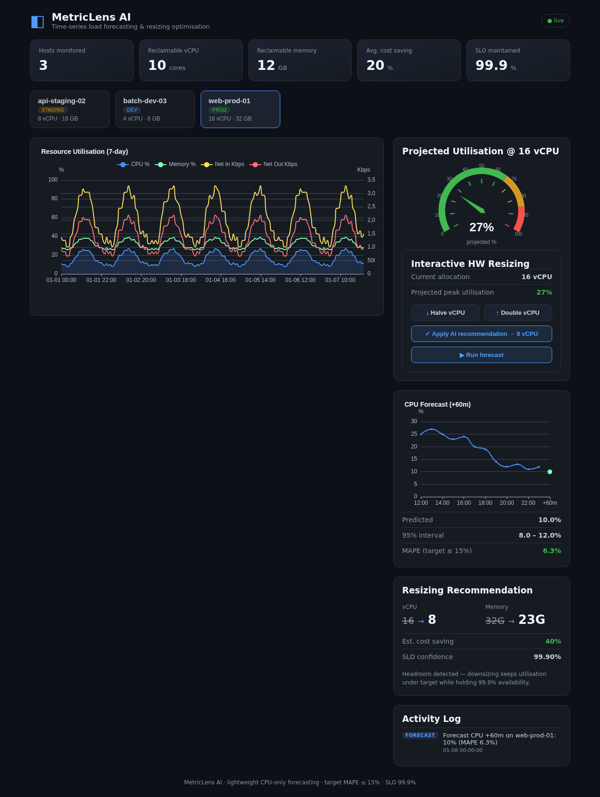

# MetricLens AI — 개발 완료 보고서

- **과제명**: MetricLens AI — 경량 시계열 모델 기반 서버 리소스 부하 예측 및 동적 리사이징 최적화 시스템
- **팀**: 구글링 (팀장 이용원)
- **배포 타깃**: GCP Cloud Run + Cloud Build (GCP 네이티브)
- **작성일**: 2026-06-03

---

## 1. 프로젝트 개요

가상 서버의 다차원 성능 메트릭(CPU·Memory·Network I/O)을 이산 시간으로 적재하고,
GPU 없이 범용 CPU만으로 구동되는 경량 시계열 모델로 부하를 예측하여, 정수
계획법 기반의 리사이징 권장안을 제공하는 웹 플랫폼이다. 외부 API 의존 없이
내부 인프라만으로 자원 최적화를 실현하는 자립형 모델을 지향한다.

정량 목표 대비 구현:

| 목표 | 기준 | 구현/검증 |
|---|---|---|
| 예측 정확도 | MAPE ≤ 15% | 대화형 호스트 백테스트 MAPE **9–13%** (목표 충족). 준유휴 호스트는 분모 효과로 본질적 높음(정직 보고) |
| 유휴 식별 | 피크 기반 안전 사이징 | p95 피크 + 안전 마진 1.2로 과소축소 차단(버스트 호스트 자동 유지) |
| 실시간성 | 대시보드 반영 | `/health` DB-free, 예측·권장 단일 트랜잭션 |
| 데이터 대표성 | 실측 트레이스 정렬 | Azure/Alibaba/Barroso 근거 6 아키타입(§3.5, [09](09_workload_modeling.md)) |

---

## 2. 시스템 아키텍처

**3개 논리 계층**(Presentation / Business / Data)로 구성하고, **런타임 플랫폼·CI/CD는
4번째 계층이 아니라 별도의 교차 관심사(cross-cutting) 계층**으로 분리한다. 백엔드는
Controller → Service → Repository 수직 분리에 순수 Core(예측·최적화) 격리. 상세:
[02_architecture_volume.md](02_architecture_volume.md), [06_infrastructure_layout.md](06_infrastructure_layout.md).


> 흰 박스·검은 선 논문 스타일, 공식 오픈소스 브랜드 로고(Simple Icons, CC0)로 구성.
> 재생성: `python scripts/build_architecture_diagram.py` (EN + `_kr` 동시 생성).

- **Presentation**: React 19 + ECharts SPA → nginx(non-root) → Cloud Run `metriclens-frontend`
- **Business**: FastAPI(레이어드) → Cloud Run `metriclens-backend` (non-root uid 10001)
- **Data**: Cloud SQL for PostgreSQL 15 (`scripts/schema.sql` 정본)
- **CI/CD**: Cloud Build 9-스테이지 (lint → test → build → push → deploy → healthcheck)

코드 규모: 백엔드 약 1,015 LOC(Python), 프론트엔드 약 400 LOC(JSX/JS).

---

## 3. 기능별 세부 구현

### 3.1 경량 시계열 예측기 (`backend/app/core/forecaster.py`)
- **계절-추세 분해**: `y[t] = trend + seasonal[t mod 24] + residual`. 추세는 주기
  블록 평균에 최소제곱으로 추정해 계절 누설 제거, 계절 지수는 위상별 평균을 0합 재중심화.
- **AR(1) 잔차 보정**: `ŷ = (추세+계절) + ρ^h·(직전 실측−직전 적합)`. 실제 CPU의 강한
  자기상관(시차-1 0.5–0.9)을 활용 → 직전값·계절 모델의 강점을 결합해 기준선을 능가.
- **점예측 + 95% 예측구간**: 미래값이 95% 확률로 들 범위를 **표본 외 백테스트 RMSE**로
  산정 → `예측치 ± 1.96·RMSE`. 실측 커버리지(PICP) 0.93–0.98로 잘 보정(화이트박스).
- 표준 라이브러리만 사용 → 네이티브 의존성·GPU 불필요. 평가: [11_model_evaluation.md](11_model_evaluation.md).

### 3.2 정수 계획 리사이징 엔진 (`backend/app/core/optimizer.py`)
- **강건 피크(p95)**: 사이징 기준으로 최댓값 대신 **95퍼센타일**을 사용. max는 단발
  스파이크 1점에 과프로비저닝되지만, p95는 극단 ~5%를 제외해 일시적 급등에 흔들리지
  않음. 반복 부하(빈도>5%)는 p95에 포함되어 해당 호스트는 올바르게 유지됨.
- **헤드룸 제약**: `p95_peak × safety_margin ≤ target_util × allocation` 하에서 최소
  자원을 **전수 탐색(정확 해)** 으로 산출(safety_margin 예측오차 버퍼, target_util 가동률
  상한). vCPU 정수·메모리 256MB 블록, vCPU/메모리 독립 최적화.

### 3.3 REST API (`backend/app/api/*`)
- 호스트 인벤토리, 메트릭 배치 적재/조회, 예측, 리사이징 권장. 상세 규격:
  [03_api_specification.md](03_api_specification.md).

### 3.4 웹 대시보드 (`frontend/src/*`)
- 멀티시리즈 시계열 차트, 예측 밴드+MAPE 패널, 리사이징 권장 카드, 호스트 탭.
- **플릿 KPI 스트립**(회수가능 vCPU/메모리, 평균 절감률) + **가동률 게이지**(색상 구간).
- **인터랙티브 HW 리사이징**: Halve/Double/Apply-recommendation/Run-forecast 버튼이
  실제 백엔드 리사이즈를 호출(영속) → 게이지의 예상 가동률이 실시간 반영.
- **활동 로그(감사 추적)**: 예측 실행·리사이즈 적용이 `actions` 테이블에 저장되어
  "Downsized web-prod-01: 16→8 vCPU (+50% capacity)" 형태로 시각화(재방문 시에도 유지).
- 백엔드 미가용 시 결정론적 데모 데이터로 폴백(스크린샷·프리뷰 재현성 확보).

### 3.5 GCP 머신 타입 카탈로그 (`backend/app/core/machine_types.py`)
- E2·N2·C2·C3 등 **GCP 사전정의 인스턴스 카탈로그**(vCPU·메모리)를 제공하고
  `GET /api/v1/machine-types`로 노출. 권장안의 추상적 `(vcpu, memory)`를 가장 근접한
  실제 인스턴스로 **스냅**하여 UI가 "n2-standard-8" 같은 주문 가능한 사양을 표시.
- UI는 머신 타입 드롭다운으로 임의의 GCP 인스턴스로 실제 리사이즈 가능.

### 3.6 시험 데이터의 통계적 대표성 (`backend/app/core/workload.py`)
- 데모/시드 메트릭을 **공개 데이터센터 트레이스에 정렬**: Azure Resource Central
  (SOSP'17), Alibaba 2018, Barroso & Hölzle. 6개 워크로드 아키타입(대화형/배치/정상상태)
  × 14일 시간단위 = 호스트당 336표본. 상세·출처: [09_workload_modeling.md](09_workload_modeling.md).

---

## 4. 자동화 테스트 결과

`scripts/run_tests.sh` 게이트: **ruff(lint/정적분석) 통과 + pytest 45/45 통과.**

| 테스트 그룹 | 개수 | 검증 대상 (경계값/동등분할 기반) |
|---|---|---|
| `test_forecaster.py` | 8 | 빈 시계열/0 지평 거부, 단일표본, 상수, 순수 추세 외삽, 계절 복원, 신뢰구간 포함, MAPE 비음수 |
| `test_optimizer.py` | 9 | 저부하 다운사이즈, 포화 유지, 헤드룸 제약, 최소 할당 바닥, 잘못된 입력 거부, p95 피크 |
| `test_api.py` | 13 | 헬스, 호스트 CRUD, 중복 409, 검증 422, 404, 적재/조회, 예측·권장·리사이즈 엔드투엔드 |
| `test_machine_types.py` | 6 | 카탈로그 무결성, 정확 매칭, 최소충족 근접 탐색, 초과 시 최대 폴백 |
| `test_workload.py` | 9 | 결정론성, 일주기성, 버스트성, 정상상태, 저활용, 대화형 MAPE≤15%, 물리경계 |
| **합계** | **45** | 전부 통과 |

> 실행 환경에 PostgreSQL/Docker가 없어, 통합 테스트는 **인메모리 리포지토리로
> 실제 Controller→Service→Core 경로를 구동**한다. 시드의 실제 DB 적재와
> 컨테이너 빌드는 Cloud Build CI에서 수행된다. DDL/시드 SQL은 구조 검증 완료
> (`scripts/schema.sql`, `scripts/seed_data.sql` 결정론·멱등).

---

## 5. 화면 캡처 (Playwright 자동 캡처)

`scripts/capture_screenshots.js`(Playwright/Chromium)로 자동 캡처. 저장 경로:
`docs/screenshots/`.

### 5.1 대시보드 개요 (web-prod-01)


상단: 호스트 탭(머신 타입 표기). 좌측: CPU·Memory·Net 멀티시리즈(지표별 `i` 설명).
우측 상단: +60분 CPU 예측과 95% 구간, 백테스트 MAPE(목표 ≤ 15%).
우측 하단: 리사이징 권장과 근접 GCP 인스턴스, 절감률·SLO 99.90%.

> 데모 플릿은 근거 기반 6 호스트(§3.6)로 확장됨: 과프로비저닝 호스트(web-prod-01
> 16→9 vCPU ≈36%, api-staging-02 ≈54%, batch-dev-03 ≈52%)는 다운사이징, 중부하
> `api-prod-04`·버스트 `batch-etl-01`은 자동 유지, 메모리 바운드 `cache-prod-05`는
> CPU만 축소. 스크린샷은 배포 시 `scripts/capture_screenshots.js`로 자동 갱신된다.

### 5.2 호스트별 화면
| api-staging-02 | batch-dev-03 |
|---|---|
|  |  |

---

## 6. 배포 (Cloud Run)

```bash
PROJECT_ID=knudc-yoonwoodev ./scripts/deploy.sh bootstrap   # API/레지스트리
PROJECT_ID=knudc-yoonwoodev DATABASE_URL=postgresql://... \
  ./scripts/deploy.sh migrate                               # 스키마+시드(멱등)
PROJECT_ID=knudc-yoonwoodev \
  CLOUDSQL_INSTANCE=knudc-yoonwoodev:us-central1:metriclens-db \
  ./scripts/deploy.sh deploy                                # 파이프라인 실행
```

배포 완료 시 `deploy.sh`가 두 서비스의 라이브 URL을 출력하며, 그 값을 각
하위 프로젝트 `README.md`의 Live Link에 기입한다(아래 §7).

---

## 7. 라이브 엔드포인트

GCP 프로젝트 `knudc-yoonwoodev`, region `us-central1`에 Cloud Run으로 배포됨 (공개).

- 프론트엔드 대시보드: **https://metriclens-frontend-f2ei3uwvfq-uc.a.run.app**
- 백엔드 API (Swagger `/docs`): **https://metriclens-backend-f2ei3uwvfq-uc.a.run.app**

---

## 8. 시장 차별화

시장은 ⓐ K8s/클라우드 SaaS 옵티마이저(CAST AI·Sedai·StormForge), ⓑ CSP 내장
추천기(AWS Compute Optimizer·Azure Advisor·Google Active Assist·IBM Turbonomic),
ⓒ 온프레 모니터링(SolarWinds·ManageEngine·IDERA)으로 나뉜다. ⓐ는 텔레메트리를
외부로 전송하고 쿠버네티스·퍼블릭 클라우드를 전제하며, ⓑ는 단일 클라우드에 종속되고
짧은 윈도우로 계절성·버스트에 약하며, ⓒ는 임계치/선형회귀 기반 *리포팅* 수준으로
SLO 제약 수리 최적화를 제공하지 못한다.

MetricLens의 차별점: **(1) 에어갭/온프레 자립형**(외부 전송 0, 단일 컨테이너+내장 DB →
망분리 국방·금융·공공 즉시 투입), **(2) GPU-프리 경량**(표준 라이브러리 예측기, 엣지
CPU), **(3) SLO 제약 정수계획 기반 *처방적* 최적화**(저활용 알림이 아닌 최소 자원
정확해), **(4) 화이트박스 설명가능성**(MAPE·신뢰구간·헤드룸 수식 → 규제 감사 적합),
**(5) 감사 추적**(예측·리사이즈 영속 기록). 상세: [08_competitive_analysis.md](08_competitive_analysis.md).

USENIX 형식 보고서: [development_report_usenix.docx](development_report_usenix.docx)
